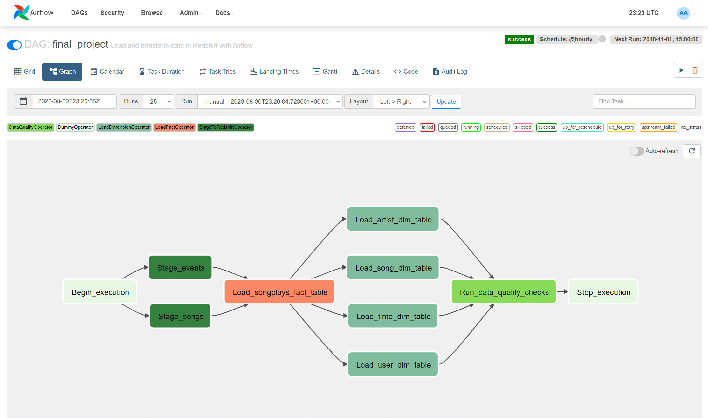

# Introduction

A music streaming company, Sparkify, has decided that it is time to introduce more automation and monitoring to their data warehouse ETL pipelines and come to the conclusion that the best tool to achieve this is Apache Airflow.
They have decided to create high-grade data pipelines that are dynamic and built from reusable tasks, can be monitored, and allow easy backfills. They have also noted that the data quality plays a big part when analyses are executed on top of the data warehouse and want to run tests against their datasets after the ETL steps have been executed to catch any discrepancies in the datasets.
The source data resides in S3 and needs to be processed in Sparkify's data warehouse in Amazon Redshift. The source datasets consist of JSON logs that tell about user activity in the application and JSON metadata about the songs the users listen to.

This project will introduce you to the core concepts of Apache Airflow. To complete the project, I created custom operators to perform tasks such as staging the data, filling the data warehouse, and running checks on the data as the final step.

# Project Datasets

I'll be working with two datasets that reside in S3. Here are the S3 links for each:
- **Song data:** `s3://udacity-dend/song_data`  
This dataset is a subset of real data from the [Million Song Dataset](http://millionsongdataset.com/). Each file is in JSON format and contains metadata about a song and the artist of that song. The files are partitioned by the first three letters of each song's track ID. For example, here are file paths to two files in this dataset:  
`song_data/A/B/C/TRABCEI128F424C983.json`  
`song_data/A/A/B/TRAABJL12903CDCF1A.json`  
And below is an example of what a single song file, TRAABJL12903CDCF1A.json, looks like.  
{ 
  "num_songs": 1,  
  "artist_id": "ARJIE2Y1187B994AB7",  
  "artist_latitude": null,  
  "artist_longitude": null,  
  "artist_location": "",  
  "artist_name": "Line Renaud",  
  "song_id": "SOUPIRU12A6D4FA1E1",  
  "title": "Der Kleine Dompfaff",  
  "duration": 152.92036,  
  "year": 0  
}

---
- **Log data:** `s3://udacity-dend/log_data`  
This dataset consists of log files in JSON format generated by this [event simulator](https://github.com/Interana/eventsim) based on the *Song dataset*. These simulate app activity logs from an imaginary music streaming app based on configuration settings. 
The log files are partitioned by year, month and day. For example, here are file paths to two files in this dataset: 
`log_data/2018/11/2018-11-12-events.json`  
`log_data/2018/11/2018-11-13-events.json`  
And below is an example of what the data in a log file, 2018-11-12-events.json, looks like.
<figure>

</figure>

---
---

# Design Star Schema

Using the song and event datasets, I'll create a star schema optimized for queries on song play analysis. This includes the following tables.  
**Fact Table**
- *songplay*: records in event data associated with song plays i.e. records with page `NextSong`  
  Columns: `songplay_id` , `start_time` , `user_id` , `level` , `song_id`, `artist_id`, `session_id` , `location`, `user_agent`  
  
**Dimension Tables**
- *user*: users in the app.  
Columns: `user_id` , ` first_name` , `last_name` , `gender` , `level`

- *song*: songs in music database.  
Columns: `song_id` , ` title` , `artist_id` , `year` , `duration`

- *artist*: artists in music database.  
Columns: `artist_id` , ` name` , `location` , `lattitude` , `longitude`

- *time*: timestamps of records in *songplay* broken down into specific units.  
Columns: `start_time` , `hour` , `day` , ` week` , `month` , `year` , `weekday`

<figure>

</figure>

---
---
---

# Technologies
- Python
- AWS S3
- AWS Redshift
- Apache Airflow

---

# Project files
- dags/sparkify_pipeline.py : Code that builds the dag
<figure>

</figure>
- plugins/final_project_operators/stage_redshift.py : The stage operator is expected to be able to load any JSON formatted files from S3 to Amazon Redshift. The operator creates and runs a SQL COPY statement based on the parameters provided. The operator's parameters should specify where in S3 the file is loaded and what is the target table.  
- plugins/final_project_operators/load_fact.py : Run the data transformations, fact tables are usually so massive that they should only allow append type functionality.  
- plugins/final_project_operators/load_dimension.py : Run data transformations, dimension loads are often done with the truncate-insert pattern where the target table is emptied before the load.  
- plugins/final_project_operators/data_quality.py : Checks on the data itself, I've implemented checking if the table is empty (doesn't have a record or not)  
- plugins/final_project_operators/sql_queries.py :
  - contains creating tables queries.
  - contains ETL queries.
